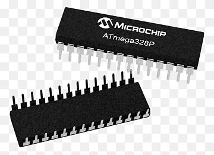

<!-- Improved compatibility of back to top link: See: https://github.com/othneildrew/Best-README-Template/pull/73 -->

<a name="readme-top"></a>

<!--
*** Thanks for checking out the Best-README-Template. If you have a suggestion
*** that would make this better, please fork the repo and create a pull request
*** or simply open an issue with the tag "enhancement".
*** Don't forget to give the project a star!
*** Thanks again! Now go create something AMAZING! :D
-->

<!-- PROJECT SHIELDS -->
<!--
*** I'm using markdown "reference style" links for readability.
*** Reference links are enclosed in brackets [ ] instead of parentheses ( ).
*** See the bottom of this document for the declaration of the reference variables
*** for contributors-url, forks-url, etc. This is an optional, concise syntax you may use.
*** https://www.markdownguide.org/basic-syntax/#reference-style-links
-->

[![Contributors][contributors-shield]][contributors-url]
[![Forks][forks-shield]][forks-url]
[![Stargazers][stars-shield]][stars-url]
[![Issues][issues-shield]][issues-url]

<!-- PROJECT LOGO -->
<br />
<div align="center">
  <a href="https://github.com/jjlittle20/eeprom-programmer">
    
  </a>

<h3 align="center">EEPROM Programmer</h3>

  <p align="center">
    Based on Ben Eater's design.
    <br />
    <a href="https://github.com/jjlittle20/eeprom-programmer/issues">Report Bug</a>
    ·
    <a href="https://github.com/jjlittle20/eeprom-programmer/issues">Request Feature</a>
  </p>
</div>

<!-- TABLE OF CONTENTS -->
<details>
  <summary>Table of Contents</summary>
  <ol>
    <li>
      <a href="#about-the-project">About The Project</a>
      <ul>
        <li><a href="#built-with">Built With</a></li>
      </ul>
    </li>
    <li>
      <a href="#getting-started">Getting Started</a>
      <ul>
        <li><a href="#prerequisites">Prerequisites</a></li>
        <li><a href="#installation">Installation</a></li>
      </ul>
    </li>
    <li><a href="#usage">Usage</a></li>
    <li><a href="#roadmap">Roadmap</a></li>
    <li><a href="#contributing">Contributing</a></li>
    <li><a href="#acknowledgments">Acknowledgments</a></li>
  </ol>
</details>

<!-- ABOUT THE PROJECT -->

## About The Project

I found that Ben Eater's EEPROM programmer project wasn't exactly what I needed so I created a way to stream the data from a .bin file over Serial with Python. Originally this was all done through the CLI but I quickly realised it would be nice to have some clickable buttons and the data displayed nicely on screen.

<p align="right">(<a href="#readme-top">back to top</a>)</p>

### Built With

- Python
- Javascript
- Arduino IDE (C++)
- BootStrap 5

<p align="right">(<a href="#readme-top">back to top</a>)</p>

<!-- GETTING STARTED -->

## Getting Started

To convert files from assembly to a .bin file for your cpu you will need a package such as sjasmplus which is for z80 archetecture. You will also need an arduino - this will work on an arduino nano with the smaller 168 ic. I am using and arduino UNO for my project. The Arduino sketch is currently hardcoded for 2048 memory addresses.

### Prerequisites

If you dont have an assembler we will use sjasmplus for the z80.

- download latest release at https://github.com/z00m128/sjasmplus/releases

Next you will need to unzip the file - somewhere permanent - and add the PATH i.e `/user/documents/sjasmplus` to the path environment variable in Windows System Properties. Make sure to edit the system variables and not the user variables.

You may need to restart your machine for it to work.

Open a command prompt and type `sjasmplus` you should see a help prompt which means it is setup correctly.

### Installation

1. Clone the repo
   ```sh
   git clone https://github.com/jjlittle20/eeprom-programmer.git
   ```
2. Upload the sketch to your arduino

3. Enter your .bin file location and COM port number in `config/settings.json`
4. run the `index.py` file

<p align="right">(<a href="#readme-top">back to top</a>)</p>

<!-- USAGE EXAMPLES -->

## Usage

1. Press READ button the read the contents of your connected EEPROM.
2. Press WRITE to write the contents of the .bin file configured in settings.json.
3. Press ERASE to erase the EEPROM

<p align="right">(<a href="#readme-top">back to top</a>)</p>

<!-- ROADMAP -->

## Roadmap

- [ ] Create a pcb for this design in an arduino HAT format
- [ ] 'POKE' command to change a specific memory address
- [ ] Ability to configure settings from UI
- [ ] Ability to set EEPROM size
  - [ ] Create a generic pin setting system to accept any EEPROM pinout

See the [open issues](https://github.com/jjlittle20/eeprom-programmer/issues) for a full list of proposed features (and known issues).

<p align="right">(<a href="#readme-top">back to top</a>)</p>

<!-- CONTRIBUTING -->

## Contributing

Contributions are what make the open source community such an amazing place to learn, inspire, and create. Any contributions you make are **greatly appreciated**.

If you have a suggestion that would make this better, please fork the repo and create a pull request. You can also simply open an issue with the tag "enhancement".
Don't forget to give the project a star! Thanks again!

1. Fork the Project
2. Create your Feature Branch (`git checkout -b feature/AmazingFeature`)
3. Commit your Changes (`git commit -m 'Add some AmazingFeature'`)
4. Push to the Branch (`git push origin feature/AmazingFeature`)
5. Open a Pull Request

<p align="right">(<a href="#readme-top">back to top</a>)</p>

<!-- LICENSE -->

<!-- CONTACT -->

<!-- ACKNOWLEDGMENTS -->

## Acknowledgments

- https://eater.net/

<p align="right">(<a href="#readme-top">back to top</a>)</p>

<!-- MARKDOWN LINKS & IMAGES -->
<!-- https://www.markdownguide.org/basic-syntax/#reference-style-links -->

[contributors-shield]: https://img.shields.io/github/contributors/jjlittle20/eeprom-programmer.svg?style=for-the-badge
[contributors-url]: https://github.com/jjlittle20/eeprom-programmer/graphs/contributors
[forks-shield]: https://img.shields.io/github/forks/jjlittle20/eeprom-programmer.svg?style=for-the-badge
[forks-url]: https://github.com/jjlittle20/eeprom-programmer/network/members
[stars-shield]: https://img.shields.io/github/stars/jjlittle20/eeprom-programmer.svg?style=for-the-badge
[stars-url]: https://github.com/jjlittle20/eeprom-programmer/stargazers
[issues-shield]: https://img.shields.io/github/issues/jjlittle20/eeprom-programmer.svg?style=for-the-badge
[issues-url]: https://github.com/jjlittle20/eeprom-programmer/issues
